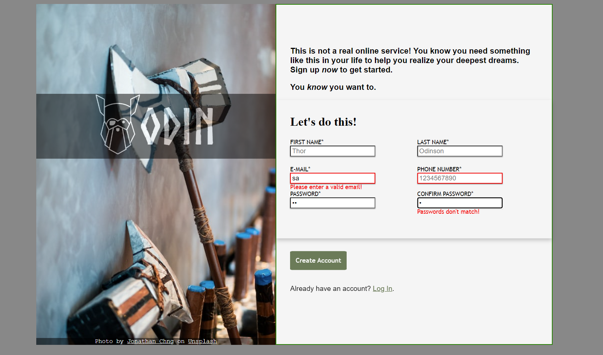

# sign-up-form
### A simple sign up form webpage using HTML/CSS/JS, an exercise for [TheOdinProject](theodinproject.com)
#### Click on the picture/the link below to try!

## [Click to open](https://redplusblue.github.io/sign-up-form/)

## Features: 
1. Validates email and phone number fields using HTML's form validation. 
2. Validates whether passwords are equal to each other using javascript. 
3. Displays error message if any of the fields are invalid. 

## What I learned/used: 
1. CSS Flexbox, box-shadow
2. Forms in HTML
3. Form validation using JS
